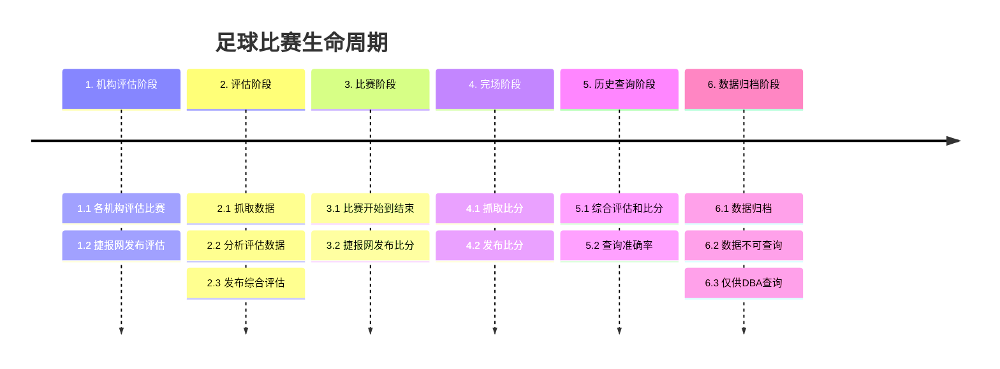
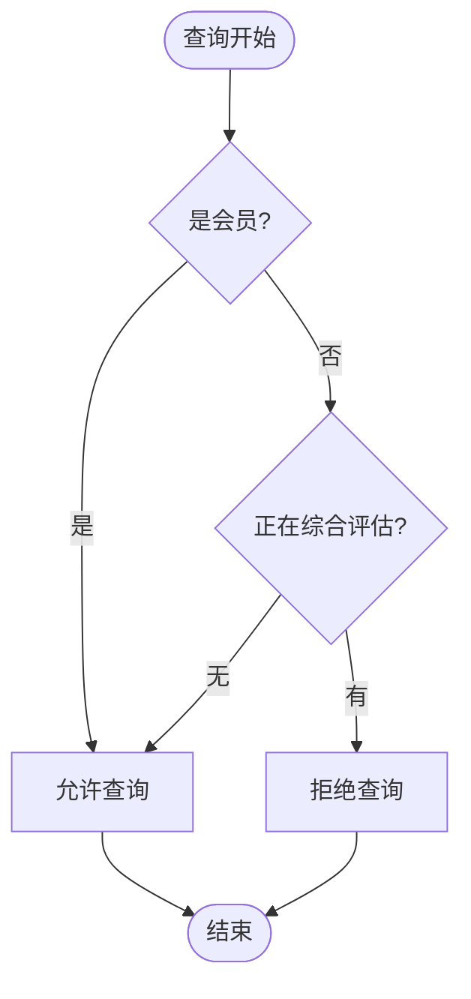
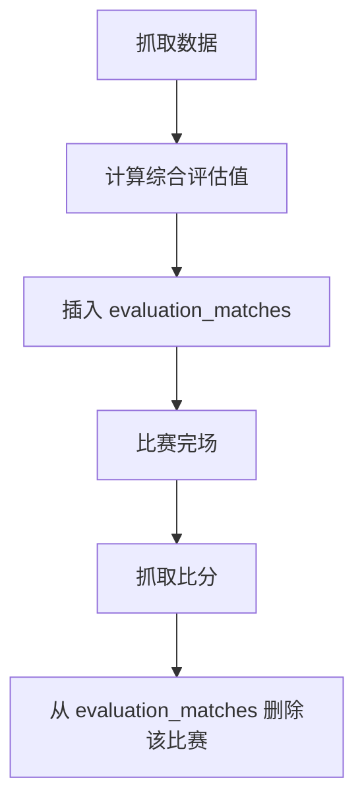

# 会员系统设计书

## 1. 概述

本系统采用**会员制**，用户通过购买不同时长的会员获得对应的数据查看权限。非会员可查看历史综合评估数据；会员可查看历史综合评估数据和当前综合评估。新注册用户赠送一次**周会员**，用于体验完整能力。

## 2. 会员类型

| 会员类型 | 有效期 | 说明 |
|----------|--------|------|
| **周会员** | 自生效时刻起 **7 天** | 适合短期体验 |
| **月会员** | 自生效时刻起 **30 天** | 常规订阅 |
| **季会员** | 自生效时刻起 **120 天** | 中长期订阅 |
| **年会员** | 自生效时刻起 **365 天** | 长期订阅 |

**约定**：

- 「开通日」以支付成功并完成权益下发的时间为准（或以业务约定的「生效时间」为准）。
- **周 / 月 / 季 / 年**：一律按**固定天数**自 `effective_at` 起算（7 / 30 / 120 / 365），`expires_at = effective_at + timedelta(days=N)`，保留同一时分秒；是否仍为会员按 `effective_at <= now < expires_at`（左闭右开）。不采用自然月/自然年，避免月末、闰年等边界歧义。
- 若存在多次购买/续费，采用「在当前剩余有效期基础上顺延」
- 以上会员起止时刻与数据库 `DATETIME`、应用 `datetime.now()` 直接比较，不做时区换算（与实现一致）。

## 3. 权限规则

### 3.1 比赛的各个阶段

### 3.2 会员权限

| 用户身份 | 机构评估阶段 | 评估阶段 | 比赛阶段 | 完场阶段 | 历史查询阶段 | 数据归档阶段 |
|-----|-----|-----|-----|-----|-----|-----|
| 非会员 | ✖️ | ✖️ | ✖️ | 🟢 | 🟢 | ✖️ |
| 会 员 | ✖️ | 🟢 | 🟢 | 🟢 | 🟢 | ✖️ |

### 3.3 权限控制

比赛是否在评估中：根据日期{YYYYMMDD}和比赛名{主队} VS {客队}，查看evaluation_matches表里是否有该场比赛

### 3.4 入表与出表

## 4. 新用户赠送周会员

### 4.1 赠送规则

- **新用户**：本设计书中，新用户指该账号从未获得过赠送周会员。
- **触发条件**：用户**注册完成**（以账号创建成功、且满足「新用户」定义的时刻为准）。
- **赠送内容**：**1 次周会员**。
- **生效时间**：注册完成即生效；
- **失效时间**：`expires_at = effective_at + 7 天`（与生效时刻同一时分秒）；`now >= expires_at` 起视为非会员（若未再购买会员）。实现上与数据库 `DATETIME`、应用 `datetime.now()` 直接比较，不做时区换算。

### 4.2 与付费会员的关系

- 若新用户在赠送周会员有效期内**购买了付费会员**，规则：
  - 在「当前剩余有效期」基础上顺延（赠送 + 付费连续享受）。

### 4.3 仅限一次

- 每个用户（以账号维度）**仅赠送一次**周会员；已领取过赠送周会员的用户，再次注册或换绑手机等不重复赠送。
- 实现时需在用户或权益表中留有「是否已赠送过周会员」标记，防止重复发放。

## 5. 充值与支付（扩展）

- **充值入口**：在用户系统（如 football-betting-platform）提供「开通会员」或「充值」入口，选择周/月/季/年会员并跳转支付。
- **支付方式**：由产品决定（微信、支付宝、苹果 IAP 等）；支付成功回调后，在会员表中写入对应记录（生效时间、失效时间、类型、订单号）。
- **发票与订单**：若需发票或订单查询，需在订单表记录支付流水、金额、商品（会员类型）等，本设计书不展开表结构。

